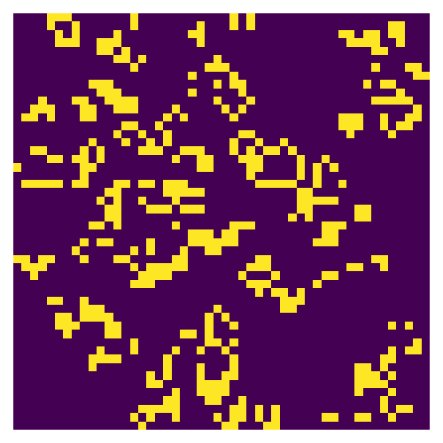

# Answers

Put any answers to questions in the assignment in this file, or any commentary you don't include in the code.

This is a markdown file (the `.md` extension gives it away). If you have never used markdown before, check out [this short guide](https://guides.github.com/features/mastering-markdown/).

## Problem 0

### Part(A)

The functions has been attached to script.py. But I do not recommend using them, unless for our problem. Beucase they are extremelly slow. What we should do in this problem is to "hard-code" the index that will be converted to.

### Part(B)

I chose sparse.lil_matrix and setting dtype = int8. Due to the nature of this problem, we will only deal with integers, mostly 0's and 1's, so 8 bits is more than enough, and it saves lots of memory as we will run into large matrix which might cause memory outage.

### Part(C)

In 100 x 100 case, we should see that there is no clear difference between `csr_matrix` and `dia_matrix`, while `csc_matrix` runs a bit slower. It makes sense because python ueses a row operating system, but `csc_matrix` is a column operating command, so it is slower than other two forms. Now for 1000 x 1000 case, `dia_matrix` performs the fastest.

This function is faster than `count_alive_neighbors`. It seems to me that it does depend on the sparse matrix type. Again as above, we have that csc_matrix runs the slowest while `csr_matrix` and `dia_matrix` are almost the same. It is resonable to believe agin that `csc_matrix` < `csr_matrix` < `dia_matrix`.

### Part(D)

`count_alive_neighbors` is much faster than other algorithms. 

In terms of memory access of `A` and `cts`, both `csc_matrix` and `csr_matrix` are similar to `count_alive_neighbors_slice`. To be specific, if m > n, then we have more rows than columns, so `csr_matrix` is more similar to `count_alive_neighbors_slice`, if m < n, then `csc_matrix` is more similar to it. The reason is that what we are doing with csc and csr are slicing columns and rows respectively in some sense.

### Part(E)

I will be using `count_alive_neighbors_slice` in this case since it is the fastest and does not require computation of adjacency grid A.

## Feedback
